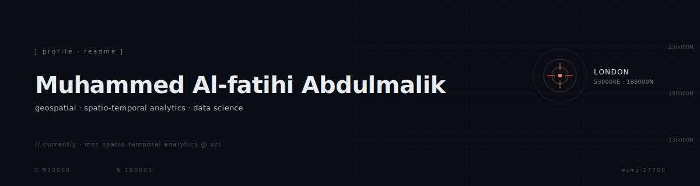
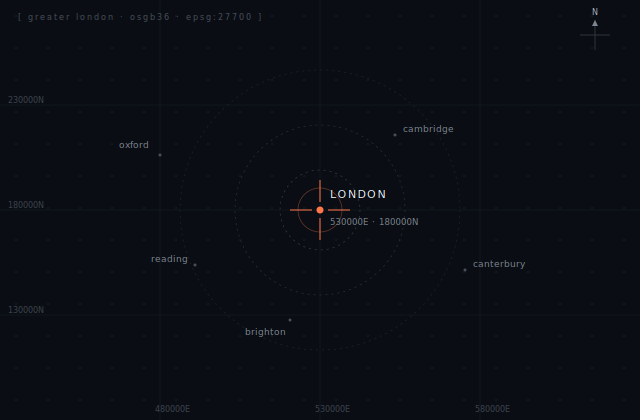

<p align="center">
  
</p>

<p align="center">
  <sub><em>geospatial data scientist · spatio-temporal analytics · london</em></sub>
</p>

<br>

## who am I?

MSc student in Spatio-temporal Analytics and Big Data Mining at UCL, finishing summer 2026. I work with messy spatial data and build things that turn it into something useful. Past projects span maritime pollution monitoring, tidal hydrodynamics, and ecological niche modelling repurposed for infrastructure siting.

Looking for graduate roles in geospatial data science, earth observation, catastrophe risk, and applied research where the work has physical, financial, or environmental stakes.

<p align="center">
  
</p>

<br>

## tech stack

```text
geospatial    PostGIS · QGIS · ArcGIS Pro · GeoPandas · Rasterio · Shapely · PyProj · MaxEnt
languages     Python · R · SQL
data & ml     Pandas · NumPy · scikit-learn · SciPy · PyTorch · Matplotlib · ggplot2 · tmap
platforms     PostgreSQL · Google Cloud Platform · Git · LaTeX
```

<br>

## elsewhere

```text
github      @placeholder
email       placeholder@domain.com
linkedin    linkedin.com/in/placeholder
site        northseawatch.org
```

<br>

<sub><em>// reading the world through coordinates, one dataset at a time</em></sub>
